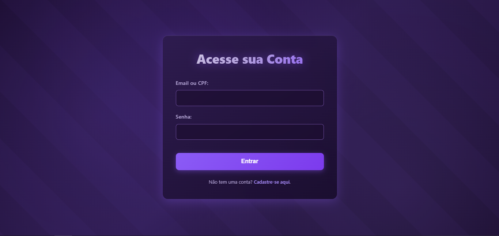
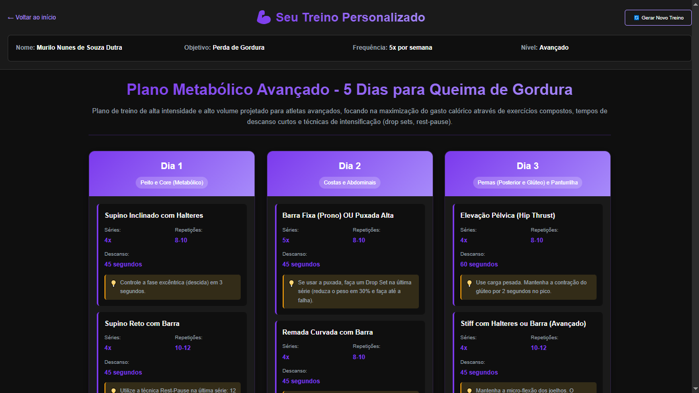

# 🏋️ GymGante - Sistema de Treinos Personalizados


O **GymGante** é uma plataforma web full-stack que revoluciona a prescrição de treinos em academias. Um **motor de regras** analisa o objetivo, a frequência semanal e o nível do aluno para montar, na hora, um plano de treino personalizado (divisão por frequência, séries/repetições/descanso por objetivo e ajustes por nível, com variação de exercícios a cada geração), algo que levaria horas para ser feito manualmente.

> 🤖 A geração com **IA (Google Gemini)** já está implementada e **desligada** nesta fase; ela será retomada nas próximas fases (`TREINO_GERADOR=gemini`).


🔗 **Acesse o projeto online:** https://gymgante-api.onrender.com/

> ⏳ Hospedado no plano gratuito do Render: o primeiro acesso após um período sem uso pode levar cerca de 50 segundos para carregar.

---

## 📸 Screenshots


<div style="display: flex; gap: 10px;">
  
  
</div>

---

## 🧠 Diferenciais Técnicos (A "Mágica")

O sistema não utiliza apenas um banco de dados estático. Ele implementa uma **Arquitetura Híbrida**:

1.  **Motor de regras:** O Back-end combina um catálogo de ~70 exercícios com regras de fisiologia (séries, repetições, descanso) conforme o objetivo do aluno (Hipertrofia, Definição ou Perda de Gordura) e ajusta o volume e as técnicas ao nível (Iniciante, Intermediário, Avançado). Os exercícios são sorteados, então cada "Novo treino" traz um plano diferente.
2.  **Segurança e Responsabilidade:** Possui uma trava lógica de segurança. Se o aluno relata lesões na anamnese, o sistema bloqueia a geração automática e direciona para um profissional humano.
3.  **Armazenamento Híbrido (SQL + JSON):** Utilizamos PostgreSQL (Neon) para dados estruturados (Usuários) e armazenamento JSON para a flexibilidade dos roteiros de treino, garantindo performance e escalabilidade.
4.  **Resiliência:** O Front-end possui parsers defensivos que conseguem renderizar o treino mesmo se o formato da resposta variar (JSON ou Markdown).
5.  **Gerador plugável:** Uma interface (`GeradorDeTreino`) separa o motor de regras da integração com IA, e uma configuração escolhe qual está ativo.

---

## 🛠️ Stack Tecnológica

### Back-End (API RESTful)
- **Linguagem:** Java 21 (LTS)
- **Framework:** Spring Boot 3
- **Segurança:** Spring Security + BCrypt (Hash de senhas)
- **Banco de Dados:** PostgreSQL (Neon)
- **Integração IA:** Google Gemini API (REST Template) — implementada, desligada nesta fase
- **Boilerplate:** Lombok

### Front-End
- **Linguagem:** JavaScript (ES6+), HTML5, CSS3
- **Design:** CSS Grid/Flexbox, Responsivo (Mobile-First)
- **Comunicação:** Fetch API (Assíncrono)
- **Renderização:** Marked.js (Markdown para HTML)

---

## 🚀 Como Rodar o Projeto

### Pré-requisitos
- Java JDK 21 e Maven (ou use o `mvnw` incluso).
- Um banco PostgreSQL (ex.: [Neon](https://neon.tech), plano gratuito).
- (Opcional, só para a fase de IA) Uma chave de API do Google Gemini (AI Studio).

### Passo 1: Clonar
```bash
git clone https://github.com/MuriloDutra2/GYMGANTE_Project.git
cd GYMGANTE_Project/gymgante-api
```

### Passo 2: Variáveis de ambiente
```bash
DB_URL=jdbc:postgresql://<host>/<banco>?sslmode=require
DB_USER=<usuario>
DB_PASSWORD=<senha>
# Opcionais:
TREINO_GERADOR=regras          # "regras" (padrão, sem IA) ou "gemini"
GEMINI_API_KEY=<sua-chave>     # só necessária com TREINO_GERADOR=gemini
```

### Passo 3: Executar
```bash
./mvnw spring-boot:run
```
Acesse http://localhost:8080 (o front-end é servido pelo próprio Spring).

Para testar sem banco externo, use o perfil `local` (H2 em memória):
```bash
./mvnw spring-boot:run -Dspring-boot.run.profiles=local
```

Para rodar os testes: `./mvnw test`.

---

## ☁️ Deploy (Render)
O projeto roda em um único Web Service no Render usando o `Dockerfile` de `gymgante-api/` (veja `render.yaml`). Configure as variáveis `DB_URL`, `DB_USER` e `DB_PASSWORD` no painel (`GEMINI_API_KEY` e `TREINO_GERADOR` são opcionais).
